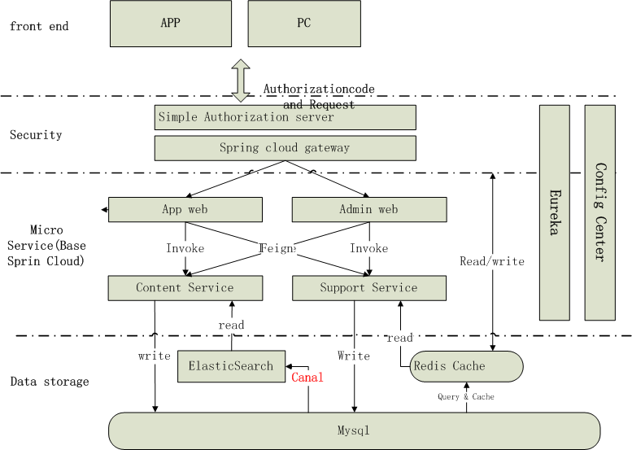

# Demos For News

![codecov]

Code for myself

* <a href="#1">Architectural</a>
* <a href="#1">App User flow path</a>
* <a href="#1">Admin User flow path</a>
* <a href="#1">Modules</a>
* <a href="#1">Use </a>
* <a href="#1">Code coverage report</a>

## environment：

| Tools | version & describe               |
| ----- | -------------------------------- |
| JDK   | 1.8                              |
| IDE   | eclipse/sts/idea		   |
| Maven | 3.x  				   |

## Technology stack

* Spring boot 2.1.6.Release
* Spring clound Finchley.SR3
* Alibaba Druid 1.1.10
* Mybatis plus 3.1.0
* Mybatis 3.5.1
* Redis 4.0
* Mysql 5.7
* ElasticSearch 

## <a name="1">Architectural</a>

## App User flow path

## Admin User flow path

## Modules
  
- news-parent
	- news-service-registry (*Service Register And Discovery Center*)
	- news-config-server (*Configuration Center*)
	- news-gateway (*API Gateway*)
	- news-auth-server (*Authorization server*)
	- news-resource-server (*Resource server*)
	- news-web-layer (*Interface for APP & admin*)
		- news-web-app (*Interface for app*)
		- news-web-admin (*Interface for admin*)
	- news-ms-layer (*Micro Service*)
		- news-ms-support (*Support Service*)
		- news-ms-content (*Content Service*)

## service planning：

| module name                               | port  | describe                             | 
| ------------------------------------------| ------| ------------------------------------ | 
| news-service-registry                	    | 8671  | Service Register And Discovery Center|
| news-config-server               	    | 8672  | config center                        |
| news-gateway               		    | 8673  | api gateway                	   | 
| news-auth-server        		    | 8674  | Authorization server                 |
| news-resource-server 			    | 8675  | Resource Server                      |
| news-web-app 				    | 8676  | App controller                       |
| news-web-admin       			    | 8677  | Admin controller                     |
| news-ms-support 			    | 8678  | Support service                      |
| news-ms-content           		    | 8679  | Content service                      |

